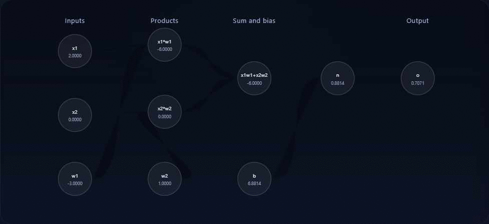

# minigrad

Minimal autograd example inspired by Andrej Karpathy's Micrograd.

This repository contains a tiny notebook implementation demonstrating a `Value`
class and a small computation graph visualized with Graphviz.

**Quick start — setup the environment**

1. From the project root, install Python dependencies via `uv`:

```bash
# Change to the project directory (adjust path if you cloned elsewhere):
cd minigrad
uv sync
```

This will create a local `.venv` and write `uv.lock`.

2. Activate the virtual environment:

```bash
source .venv/bin/activate
```

3. (Optional) If you prefer conda, you can instead install the system Graphviz
	 binary from the `conda-forge` channel (see Graphviz note below).

**Register this environment as a Jupyter kernel**

After activating the `.venv`, run:

```bash
.venv/bin/python -m ipykernel install --user --name minigrad --display-name "Python (minigrad)"
```

Then choose the kernel named `Python (minigrad)` inside Jupyter Notebook, JupyterLab, or VS Code.

**Graphviz (system binary) — required for rendering**

The Python `graphviz` package is installed by `uv sync`, but it requires the
Graphviz system `dot` executable to render diagrams. Install it on your system
if `draw_dot()` raises an `ExecutableNotFound` error.

Examples:

```bash
# Conda (recommended if you use conda):
conda install -c conda-forge graphviz

# Debian/Ubuntu:
sudo apt install graphviz

# Fedora:
sudo dnf install graphviz
```

After installing the `dot` binary, restart the kernel and rerun the rendering cell.

**Running the notebook**

Open `notebooks/1.ipynb` in your preferred notebook UI, pick the `Python (minigrad)` kernel,
and run the cells. Cell 4 (the graph drawing cell) will produce an SVG visualization if
Graphviz is available on PATH.

**Running the web visualizer**

The browser app lives in `web/` and does not need a build step. From the project root, run:

```bash
python -m http.server 8000 --directory web
```

Then open:

```text
http://localhost:8000/
```

If you prefer to use the project environment explicitly, this also works:

```bash
cd /home/ajana/Code/minigrad
uv run python -m http.server 8000 --directory web
```

The page includes Play/Pause/Step controls, a timeline scrubber, and sliders for `x1`, `x2`, and the target value.

**Animated preview**

An animation of the web visualizer is embedded below.



**Troubleshooting**

- If you see "failed to execute PosixPath('dot')" or `ExecutableNotFound`, install the
	Graphviz system package (see instructions above) and restart your kernel.
- If `uv` is not installed globally, install it locally via `python -m pip install --user uv`.

**License**

MIT — see the `LICENSE` file in the repository root.

